## 💎 New Contracts for Finale: Demonstrating Staking & Governance

To showcase the future vision of the Inzo protocol beyond the core MVP, two new standalone contracts have been developed and deployed. These modules demonstrate the key tokenomic pillars of **staking for a decentralized capital pool** and **on-chain governance** using the native `InzoUSD` token. They are presented as live, interactive "feature previews."

### 5. InzoStake.sol - The Future Capital Pool 🏦

This contract demonstrates the mechanism for a decentralized, yield-bearing capital pool where the community can underwrite the protocol's insurance risk.

- **Purpose:** To allow `InzoUSD` holders to stake their tokens and earn a share of the protocol's premium income, forming a resilient and scalable treasury.
- **Deployed Address:** [`0x4c26a70c7d3A185f8f43570567C4bE84113765D9`]
- **Key Functions:**
  - `stake(amount)`: Allows users to deposit `InzoUSD` into the pool after an `approve` call.
  - `withdraw(amount)`: Allows users to retrieve their principal stake.
  - `claimReward()`: Allows users to claim the `InzoUSD` rewards they have earned over time.
  - `addRewards(amount)`: An `onlyOwner` function for the demo that simulates premium income being added to the reward pool. In a full integration, this would be called by the `InsuranceFundManager`.
- **Significance:** This contract proves the viability of a decentralized underwriting model, a critical step towards creating a self-sustaining, community-owned insurance protocol. It transitions the capital source from a simple treasury to an active, yield-bearing DeFi primitive.

### 6. InzoPoll.sol - Lightweight On-Chain Governance 🗳️

This contract provides a simple but powerful mechanism for token-based governance, allowing the community to signal their preferences on key protocol decisions.

- **Purpose:** To use a user's `InzoUSD` balance as voting power to decide the outcome of on-chain proposals.
- **Deployed Address:** [`0x7bD4DF7D89c3664112716b72A22630F0EC61f0Fd`]
- **Key Functions:**
  - `createPoll(description)`: An `onlyOwner` function to create new proposals. For the demo, proposals are created via the dashboard.
  - `vote(pollId, inFavor)`: Allows any user holding `InzoUSD` to cast a vote. Their vote's weight is equal to their token balance at the time of voting.
  - `polls(pollId)`: A public view function to check the description and current vote tally for any poll.
- **Significance:** This module demonstrates a clear path to decentralization. By giving `InzoUSD` holders a direct voice in the protocol's evolution, it lays the foundation for a true DAO and fulfills the promise of a community-governed financial safety net.

---

# 🛡️ Inzo Protocol: Core Smart Contracts

This repository contains the core Solidity smart contracts that power the Inzo decentralized insurance platform. These contracts are designed to run on Polkadot Asset Hub, leveraging the efficiency and security of PolkaVM. Our architecture prioritizes transparency, modularity, and a clear separation of concerns to build a resilient on-chain foundation for AI-enhanced insurance services.

## 🚀 Vision

Inzo aims to revolutionize the insurance industry by creating a transparent, efficient, and user-centric platform. We combine off-chain AI-driven processes for KYC, policy underwriting, and claim investigation with the immutable trust of on-chain smart contracts for policy management, fund administration, and oracle data relay.

## ⛓️ Core Contract Architecture

The Inzo protocol is built upon a set of interoperable smart contracts, each with a distinct responsibility:

1.  **`InzoUSD.sol` (ERC20 Utility Token):** The primary medium of exchange for all financial operations within the Inzo ecosystem.
2.  **`PolicyLedger.sol` (Immutable Policy Registry):** The definitive source of truth for all insurance policy data, terms, and statuses.
3.  **`ClaimOracleRelay.sol` (Secure Data Oracle Gateway):** The trusted on-chain interface for off-chain oracle services to submit KYC attestations and claim assessment decisions.
4.  **`InsuranceFundManager.sol` (Treasury & Capital Pool):** Manages the pool of `InzoUSD` collected as premiums and disburses funds for approved claims.

*(For the MVP, a `PolicyLifecycleManager.sol` was initially envisioned as an on-chain orchestrator. Due to hackathon constraints and compiler limitations in certain IDE environments, this orchestration logic is currently handled by a client-side application/bot. The contracts below are designed to support this client-side orchestration while allowing for a future on-chain orchestrator.)*

---

```mermaid
%%{init: {'theme': 'base', 'themeVariables': { 'primaryColor': '#5E81AC', 'lineColor': '#D8DEE9', 'textColor': '#2E3440', 'actorBorder': '#5E81AC', 'actorBkg': '#ECEFF4'}}}%%
graph LR
    subgraph "User Layer"
        User["👤 Policyholder"]
        UI["📱 UI (Bot/dApp)"]
    end

    subgraph "Off-Chain Orchestration & AI"
        ClientApp["🤖 Client App/Backend"]
        AIService["🧠 AI Services<br/>(KYC, Risk, Claim Analysis)"]
        OracleBackend["🔑 Oracle Backend"]
    end

    subgraph "Polkadot Asset Hub (On-Chain)"
        subgraph "Core Contracts"
            IUS["💵 InzoUSD (ERC20)<br/>+ mint, transfer, approve"]
            PL["📜 PolicyLedger<br/>+ createPolicy, updateStatus<br/>+ getPolicyDetails"]
            COR["📡 ClaimOracleRelay<br/>+ updateKyc, submitDecision<br/>+ getDecision"]
            IFM["🏦 InsuranceFundManager<br/>+ collectPremium, processPayout"]
        end
        subgraph "Future On-Chain"
            IGT["🗳️ INZO Gov/Staking (Future)"]
            XCM["🔗 XCM"]
        end
    end

    User -- "Interacts" --> UI;
    UI --> ClientApp;

    ClientApp -->|"KYC/Policy/Claim Data"| AIService;
    AIService -->|"Processed Data"| OracleBackend;
    OracleBackend -->|"updateKycStatus()"| COR;
    OracleBackend -->|"submitClaimDecision()"| COR;
    
    ClientApp -->|"createPolicy()"| PL;
    ClientApp -->|"updatePolicyStatus()"| PL;
    
    User -- "Approves InzoUSD" --> IUS;
    ClientApp -->|"collectPremium()"| IFM;
    IFM -.->|"transferFrom()"| IUS;
    
    ClientApp -->|"processClaimPayout()"| IFM;
    IFM -.->|"transfer()"| IUS;

    ClientApp -->|"Reads Policy Data"| PL;
    ClientApp -->|"Reads Oracle Data"| COR;

    IGT -.->|"Governs"| PL;
    IGT -.->|"Governs"| IFM;
    PL <-.->|"Interoperability"| XCM;

    style User fill:#ECEFF4,stroke:#4C566A
    style UI fill:#E5E9F0,stroke:#4C566A
    style ClientApp fill:#BF616A,stroke:#2E3440,color:white
    style AIService fill:#A3BE8C,stroke:#2E3440,color:black
    style OracleBackend fill:#EBCB8B,stroke:#2E3440,color:black
    style IUS fill:#B48EAD,stroke:#2E3440,color:white
    style PL fill:#88C0D0,stroke:#2E3440,color:black
    style COR fill:#81A1C1,stroke:#2E3440,color:white
    style IFM fill:#5E81AC,stroke:#2E3440,color:white
    style IGT fill:#D08770,stroke:#2E3440,color:white
```

## 📄 Contract Details & Functionality

### 1. `InzoUSD.sol` - The Platform Currency 💵

*   **Standard:** ERC20 Compliant Token.
*   **Purpose:** Facilitates all value transfer within the Inzo ecosystem, including premium payments by policyholders and claim payouts to beneficiaries.
*   **Key Functions:**
    *   Standard ERC20 functions: `transfer()`, `approve()`, `transferFrom()`, `balanceOf()`, `totalSupply()`, `name()`, `symbol()`, `decimals()`.
    *   `mint(to, amount)`: `onlyOwner` function to create new tokens. Used for initial capitalization of the ecosystem (e.g., funding users' Inzo Wallets, pre-funding the insurance pool).
    *   `burn(amount)`: Allows users to burn their own tokens.
*   **Ownership:** `Ownable` by a deployer/admin address, granting control over minting.
*   **Significance:** Provides a stable and dedicated token for platform operations, simplifying accounting and user experience.

### 2. `PolicyLedger.sol` - The Ledger of Truth 📜

*   **Purpose:** To immutably store and manage the details, terms, and lifecycle status of every insurance policy issued on the Inzo platform.
*   **Key Data Structures:**
    *   `PolicyStatus` enum: (`PendingApplication`, `Active`, `Expired`, `Cancelled`, `ClaimUnderReview`, `ClaimPaid`, `ClaimRejected`)
    *   `RiskTier` enum: (`Standard`, `Preferred`, `HighRisk`)
    *   `Policy` struct: Contains `policyId`, `policyHolder` (their Inzo Wallet address), `currentStatus`, `riskTier`, `premiumAmount`, `coverageAmount`, `startDate`, `endDate`, `assetIdentifier` (string), `policyDetailsHash` (bytes32 hash of off-chain detailed terms).
    *   `CreatePolicyInput` struct: Used as a parameter for creating new policies.
    *   `UpdatePolicyTermsInput` struct: Used for modifying existing policy terms.
    *   `policies`: `mapping(uint256 => Policy)` storing all policy data.
    *   `userPolicies`: `mapping(address => uint256[])` for querying policies by holder.
*   **Key Functions (primarily restricted to an authorized orchestrator address):**
    *   `setPolicyLifecycleManager(address _managerAddress)`: `onlyOwner` to set the authorized orchestrator (e.g., client app's wallet address).
    *   `createPolicy(CreatePolicyInput calldata _input)`: `onlyPolicyLifecycleManager` - Creates a new policy entry with status `PendingApplication`. Emits `PolicyCreated`.
    *   `updatePolicyStatus(uint256 _policyId, PolicyStatus _newStatus)`: `onlyPolicyLifecycleManager` - Updates the status of a policy (e.g., to `Active` after premium payment, or `ClaimUnderReview` after a claim is filed). Emits `PolicyStatusUpdated`.
    *   `updatePolicyTerms(uint256 _policyId, UpdatePolicyTermsInput calldata _termsInput)`: `onlyPolicyLifecycleManager` - Allows modification of core policy terms if needed (e.g., endorsements, coverage changes), provided the policy is in an appropriate state. Emits `PolicyTermsUpdated`.
*   **View Functions (Public):**
    *   `getPolicyEssentialDetails(policyId)`: Returns core details of a policy.
    *   `getPolicyAssetIdentifier(policyId)`: Returns the asset identifier string.
    *   `getPolicyStatus(policyId)`: Returns the current status enum of a policy.
    *   `getPolicyFinancialTerms(policyId)`: Returns premium, coverage, and risk tier.
    *   `getUserPolicyIds(userAddress)`: Returns an array of policy IDs owned by a user.
*   **Significance:** Provides an auditable and transparent record of all insurance contracts, their terms, and their current state, forming the backbone of trust.

### 3. `ClaimOracleRelay.sol` - The Oracle Gateway 📡

*   **Purpose:** Acts as a secure on-chain point of contact for trusted off-chain oracle services to submit KYC attestations and claim assessment outcomes.
*   **Key Data Structures:**
    *   `ClaimDecision` struct: Stores `policyId`, `claimId` (system-generated), `isApproved`, `payoutAmount`, `processedByOracle`, `timestamp`.
    *   `kycVerifiedUsers`: `mapping(address => bool)`
    *   `processedClaims`: `mapping(bytes32 => ClaimDecision)` (maps a hash of `policyId` and `claimId` to the decision).
*   **Key Functions:**
    *   `setOracleAddress(address _newOracleAddress)`: `onlyOwner` to designate the trusted oracle wallet.
    *   `updateKycStatus(address _userAddress, bool _isVerified)`: `onlyOracle` - Allows the oracle to mark a user's Inzo Wallet as KYC verified. Emits `KycStatusUpdated`.
    *   `submitClaimDecision(policyId, claimId, isApproved, payoutAmount)`: `onlyOracle` - Allows the oracle to submit its finding for a specific claim. Emits `ClaimDecisionSubmitted`. Prevents re-submission for the same `policyId`+`claimId`.
    *   `revertClaimDecision(policyId, claimId)`: `onlyOracle` - Allows the oracle to retract/delete a previously submitted decision (e.g., in case of error before final processing). Emits `ClaimDecisionReverted`.
*   **View Functions (Public):**
    *   `isKycVerified(userAddress)`
    *   `getClaimDecision(policyId, claimId)`
    *   `hasClaimBeenProcessed(policyId, claimId)`
*   **Significance:** Decouples the on-chain logic from the specifics of the off-chain oracle/AI implementation, allowing flexibility and ensuring data integrity via a trusted, singular oracle address per function.

### 4. `InsuranceFundManager.sol` - The Capital Pool Manager 🏦

*   **Purpose:** To securely manage the `InzoUSD` tokens collected as premiums and to disburse funds for validated claims. It acts as the protocol's treasury.
*   **Key Features:**
    *   Holds `InzoUSD` tokens.
    *   `ReentrancyGuard` on fund transfer functions.
*   **Key Functions (primarily restricted to an authorized orchestrator address):**
    *   `setPolicyLifecycleManager(address _newPlmAddress)`: `onlyOwner` to set the authorized orchestrator.
    *   `collectPremium(policyId, payerAddress, premiumAmount)`: `onlyPolicyLifecycleManager` (orchestrator) - Called after the user (`payerAddress`) has approved this IFM contract to spend their `InzoUSD`. Transfers premium from payer to this IFM contract. Emits `FundsDepositedForPremium`.
    *   `processClaimPayout(policyId, beneficiaryAddress, payoutAmount)`: `onlyPolicyLifecycleManager` (orchestrator) - Transfers `InzoUSD` from this IFM contract to the `beneficiaryAddress` for an approved claim. Emits `ClaimPayoutProcessed`.
*   **View Functions (Public):**
    *   `getFundBalance()`: Returns the total `InzoUSD` held by the IFM.
    *   `totalPremiumsCollected`, `totalClaimsPaidOut`: Public counters for transparency.
    *   `getPremiumPaidForPolicy(policyId)`: Tracks premium paid for a specific policy.
*   **Emergency Functions:** `onlyOwner` functions (`emergencyWithdrawERC20`, `emergencyWithdrawNative`) to allow recovery of accidentally sent tokens or native currency.
*   **Significance:** Ensures the secure and transparent handling of user premiums and claim payouts, forming the financial core of the insurance operations.

---

## 💡 Tokenomics & Future Vision

While the current MVP focuses on `InzoUSD` as the utility token for premiums and payouts, the Inzo protocol is designed with a more sophisticated tokenomic future in mind, centered around a native **`INZO`** token.

### Current: `InzoUSD` (Utility Stablecoin) 🪙

*   **Medium of Exchange:** All premiums are paid in `InzoUSD`, and all claims are paid out in `InzoUSD`. This provides stability and predictability for financial operations within the platform.
*   **Capital Pool:** The `InsuranceFundManager` holds `InzoUSD`, forming the capital pool to cover claims.

### Future: `INZO` (Governance, Staking & Incentives) 🌟

The `INZO` token will be introduced to enhance decentralization, incentivize participation, and align the interests of all ecosystem stakeholders.

1.  **Governance:**
    *   `INZO` token holders will be able to propose and vote on key protocol parameters, such as:
        *   Risk assessment models and premium calculation adjustments.
        *   New insurance product lines (e.g., travel, gadget, event cancellation).
        *   Updates to the claim assessment process or oracle network requirements.
        *   Treasury management and allocation of funds from `InsuranceFundManager` surplus.
        *   Fee structures for policy origination or claims.

2.  **Staking & Yield:**
    *   **Policyholder Staking:** Users can stake `INZO` tokens to receive benefits like reduced premium rates, higher coverage limits, or loyalty rewards.
    *   **Underwriting / Capital Provision:**
        *   `INZO` (or `InzoUSD` locked by `INZO` stakers) can be staked into the `InsuranceFundManager` or into specific, segregated risk pools for different insurance products.
        *   Stakers who underwrite risk would earn a share of the collected premiums and/or yield generated from the capital pool (e.g., if idle capital is deployed into low-risk DeFi yield strategies). This decentralizes the capital provision beyond initial funding.

3.  **Incentives & Rewards:**
    *   **Oracle Network:** If Inzo transitions to a decentralized oracle network, `INZO` tokens can be used to reward oracle operators for providing accurate and timely data for KYC and claim verification.
    *   **Claim Assessors:** For a decentralized claim assessment or dispute resolution layer, `INZO` tokens can reward community members who participate and vote honestly.
    *   **Liquidity Mining/Participation:** Early adopters and active users could be rewarded with `INZO` tokens.

4.  **Fee Accrual & Value Capture:**
    *   A small percentage of premiums collected or fees from policy origination could be used to:
        *   Buy back and burn `INZO` tokens (deflationary pressure).
        *   Distribute as rewards to `INZO` stakers.
        *   Fund the DAO treasury for future development and ecosystem growth.

---

## 🧩 Future Polkadot Asset Hub & Ecosystem Integrations

The current contracts form a robust base. Future development will focus on deeper integration with Polkadot's unique features:

1.  **XCM (Cross-Consensus Message Format):**
    *   **Diverse Premiums/Collateral:** Accept premium payments in various native tokens from other parachains on Asset Hub or even across the Polkadot network (e.g., DOT, other stablecoins, parachain-specific tokens).
    *   **Interoperable Policies:** Inzo policy data (or future tokenized representations of policies) could be referenced or utilized by DeFi protocols on other parachains (e.g., as a form of collateral, or to unlock certain financial services).
    *   **Data Feeds:** Consume verified data feeds (e.g., weather data for parametric insurance, identity attestations) from specialized oracle parachains via XCM.

2.  **Native Asset Hub Features:**
    *   **NFTs as Policies (Revisit):** If compiler/IDE constraints ease or PolkaVM evolves, representing policies as native NFTs on Asset Hub (with on-chain dynamic metadata) could be revisited for enhanced composability and user experience.
    *   **Sufficient Assets for Fees:** Allow users to pay transaction fees on Asset Hub using `InzoUSD` (if it becomes a "sufficient asset") instead of the native network token, improving UX.

3.  **Identity Pallets & Verifiable Credentials:**
    *   Integrate with Polkadot's evolving on-chain identity solutions (e.g., KILT, Litentry) to allow users to link their Inzo KYC status to a more universal, self-sovereign digital identity, potentially reducing the need for repeated KYC across dApps.

4.  **Scheduler Pallet & Automation:**
    *   Automate recurring premium payments (with user consent via smart contract allowance).
    *   Trigger policy expiration notifications or automated renewal processes.
    *   Schedule periodic checks or data updates related to policies.

5.  **Optimized Execution with Native Precompiles:**
    *   If Asset Hub or PolkaVM introduces native precompiled contracts for common complex operations (e.g., advanced cryptographic functions for ZK-proofs, specific financial calculations), Inzo could leverage these for significantly reduced gas costs and faster execution of on-chain logic.

6.  **Decentralized Storage Integration:**
    *   Store hashed policy documents, claim evidence, and AI analysis reports on decentralized storage networks (e.g., Crust, IPFS via Filecoin), with hashes recorded on-chain in `PolicyLedger` for verifiability.

By building on Polkadot Asset Hub, Inzo is positioned to grow into a highly interoperable, efficient, and feature-rich decentralized insurance protocol.
